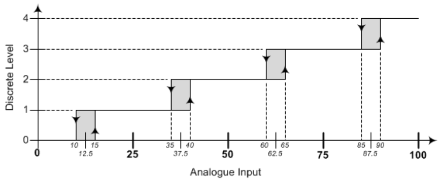

# ADC with Hysteresis

## This program represents an input analogue voltage (0-100) and converts into a discrete level (0-4).

 

## How to Run:
### Run the command below to execute the program using the Makefile.
```
./run.sh
```
